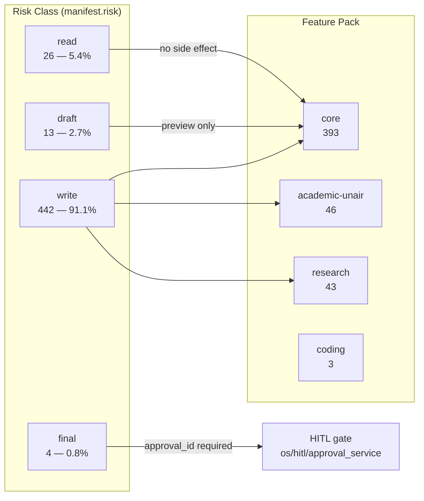
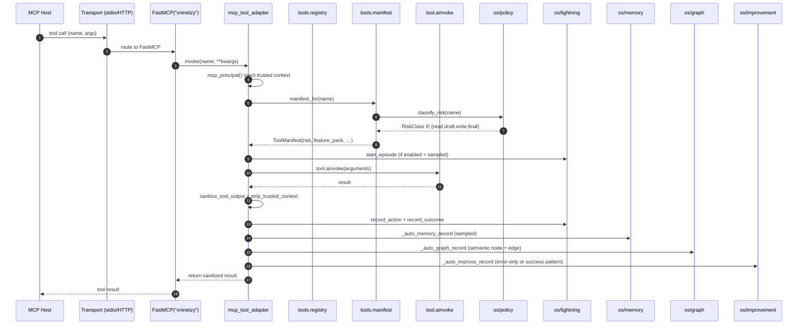
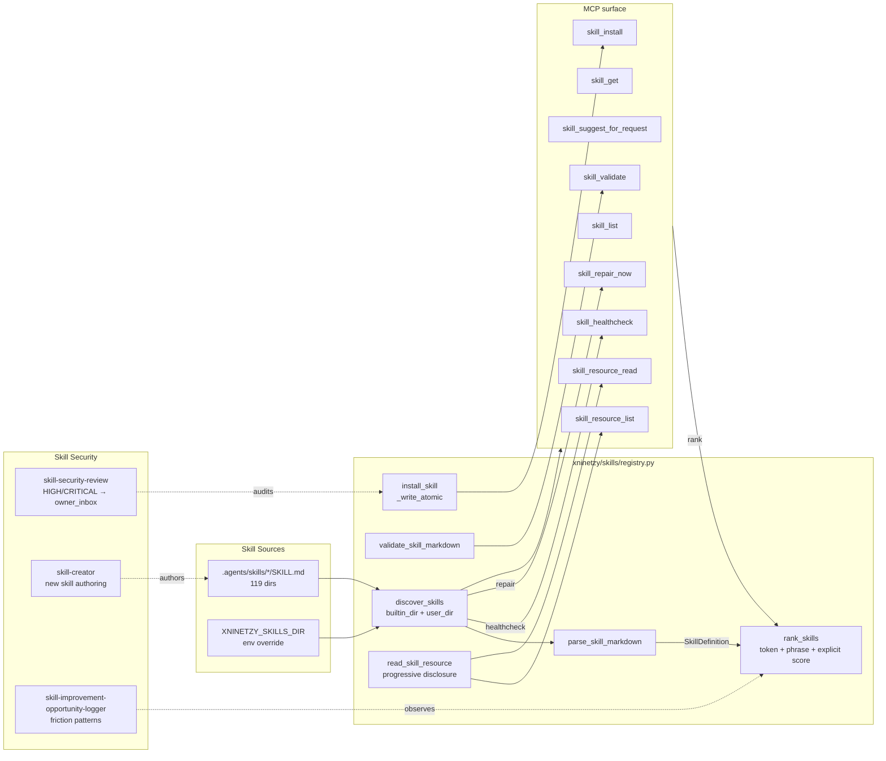
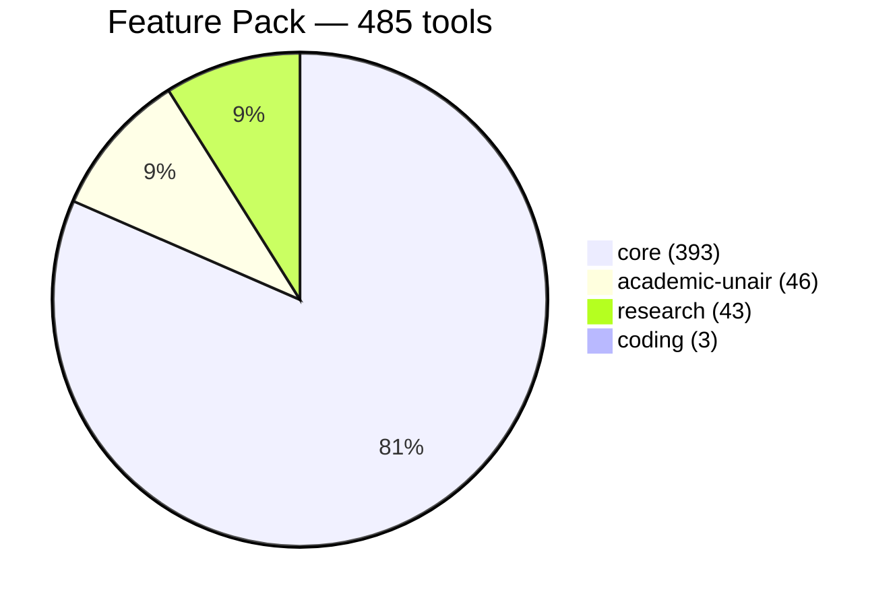
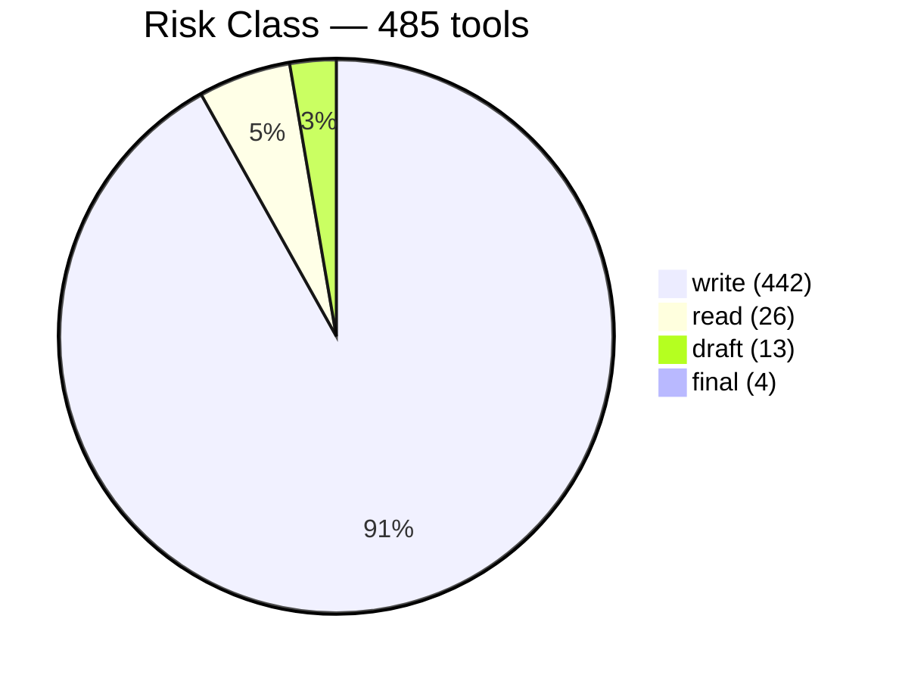

# Xninetzy Codebase Audit — MCP System, Skills, Tooling

**Recorded:** 2026-09-24
**Repo:** `/home/misbahul45/code/xninetzy` (Xninetzy v2.2.0)
**Index:** 15,901 nodes · 56,498 edges · 9 languages · 768 Python files

---

## TL;DR

| Layer | Count | Status |
|---|---|---|
| MCP tools registered | **485** | ✅ audited (`scripts/mcp_audit.py`) |
| Skill SKILL.md files on disk | **119** (66 builtin + 53 sub-skill bundles) | ⚠️ 53 invalid YAML frontmatter (ISS-20260919-01) |
| Loadable skills | **66** (61 builtin + 5 owner-installed) | ✅ |
| OS subsystems | 18 packages under `xninetzy/os/` | ✅ |
| Tool source files | 63 files in `xninetzy/tools/` | ✅ |
| Test collection | **1,666 tests** | 811 pass / 29 fail / 7 collection-blocked |
| Lint (ruff) | 39 errors (29 auto-fixable) | ⚠️ non-blocking |
| CPU-only guard | `device=cpu`, faiss-cpu, no CUDA | ✅ |
| Idempotency gaps in MCP surface | **0** | ✅ |
| FINAL-risk tools | **4** (`hebat_upload_submission`, `portal_krs_war_arm`, `qa_fill_kuesioner`, `tableau_publish_workbook`) | ✅ all HITL-gated |

> **Drift flag:** README badge claims `410 tools`; the live registry exposes **485**. README needs refresh.

---

## 1. MCP System Domain

### 1.1 Architecture diagram (C4 container view)

```mermaid
flowchart TB
    subgraph HOST["MCP Host (Claude / Codex / OpenCode / Claude Code)"]
        H1[reasoning loop<br/>owned by host]
        H2[skill picker<br/>uses skill_suggest_for_request]
    end

    subgraph TRANSPORT["Transport"]
        T1[stdio<br/>primary, default]
        T2[Streamable HTTP<br/>loopback 127.0.0.1:8765/mcp<br/>XNINETZY_MCP_TRANSPORT]
    end

    subgraph ENTRY["Entry — xninetzy/interfaces/mcp_server.py"]
        E1[FastMCP 'xninetzy'<br/>+ instructions]
        E2[skills_index_resource]
        E3[tools_catalog_resource]
        E4[memory_checklist_prompt]
        E5[main stdio|streamable-http]
    end

    subgraph ADAPTER["Adapter — mcp_tool_adapter.py"]
        A1[expose_xninetzy_tools]
        A2[langchain_tool_as_mcp_callable]
        A3[MCPPrincipal + mcp_principal]
        A4[_auto_memory_record]
        A5[_auto_graph_record]
        A6[_auto_improve_record]
        A7[sanitize_tool_output / strip_trusted_context]
    end

    subgraph REG["Registry — xninetzy/tools/"]
        R1[registry.get_all_tools<br/>485 tools]
        R2[manifest.manifest_for<br/>risk + feature_pack]
        R3[release_check.release_gate]
        R4[tool_meta / tool_results]
        R5[internal/* 14 files<br/>+ ecosystem/* 33 files]
    end

    subgraph POLICY["Policy & Safety"]
        P1[os/policy/action_policy<br/>RiskClass + ActionMode]
        P2[os/hitl/approval_service]
        P3[core/security<br/>sanitize + strip_trusted_context]
        P4[os/security/captcha/lockout]
    end

    subgraph OBS["Observability"]
        O1[observability/trace]
        O2[os/lightning/rl<br/>episode + reward]
        O3[langfuse_trace]
    end

    subgraph DB["Persistence — xninetzy/db/"]
        D1[sqlite.init_db]
        D2[sqlite.connect]
        D3[migrations.run_migrations]
    end

    subgraph OSKERN["OS kernel — xninetzy/os/ (18 packages)"]
        K1[academic<br/>HEBAT · portal · QA]
        K2[knowledge<br/>FAISS hybrid RAG]
        K3[memory<br/>episode · procedure · failure]
        K4[lightning<br/>RL bandit]
        K5[learning · life · reminders<br/>notes · rules · style]
        K6[graph v3 · inbox · hitl<br/>jobs · backup · research<br/>process_engineering]
    end

    H1 --> T1
    H1 --> T2
    T1 --> E1
    T2 --> E1
    E1 --> E5
    E5 -->|expose| A1
    A1 -->|get_all_tools| R1
    A1 -->|manifest_for| R2
    A2 -->|mcp_principal| A3
    A2 --> A4
    A2 --> A5
    A2 --> A6
    A2 --> A7
    A2 -->|start_episode| O2
    A2 -->|measure| OBS
    A1 -->|tool lookup| POLICY
    R1 --> R5
    R5 --> OSKERN
    R2 --> P1
    R1 --> D1
    D1 --> D3
```

### 1.2 Tool risk + feature-pack distribution



**FINAL tools (require HITL approval_id):**
- `hebat_upload_submission` — HEBAT/Moodle task upload
- `portal_krs_war_arm` — KRS War auto-submit arming
- `qa_fill_kuesioner` — QA Kuesioner Universitas Airlangga
- `tableau_publish_workbook` — Tableau Server publish

### 1.3 MCP request lifecycle (sequence)



### 1.4 Identity, idempotency, replay safety

| Concern | Implementation | Source |
|---|---|---|
| Trusted principal | `MCPPrincipal` injected server-side from `Settings.MCP_PRINCIPAL_ID` / `OWNER_PHONE_NUMBER` / `ADMIN_JID` | `xninetzy/interfaces/mcp_tool_adapter.py:42-55` |
| Trusted context fields stripped from client kwargs | `TRUSTED_CONTEXT_FIELDS = {chat_id, sender_id, sender_name, chat_type, group_name, metadata}` | `xninetzy/interfaces/mcp_tool_adapter.py:18-20` |
| Idempotency key | Every mutation tool accepts `idempotency_key: str = ""`, routed via `xninetzy.db.idempotency.idempotent_call` | `xninetzy/tools/registry.py` |
| FINAL risk gate | `_effective_tier = max(declared, manifest_tier)`; FINAL → requires `approval_id` from HITL | `xninetzy/os/policy/action_policy.py` |
| Transport lockdown | Streamable HTTP must bind `127.0.0.1`; non-loopback raises `ValueError` | `xninetzy/interfaces/mcp_server.py:38-48` |

---

## 2. Skills Domain

### 2.1 Skill discovery + install pipeline



### 2.2 Skill catalog (66 loadable)

| Source | Count | Trust level |
|---|---|---|
| `builtin` (under `.agents/skills/`) | 61 | `trusted-builtin` |
| `user` (under `XNINETZY_SKILLS_DIR`) | 5 | `owner-installed` |

#### Domain buckets of loadable skills

| Bucket | Count | Examples |
|---|---|---|
| research / academic | 19 | `paper-analysis`, `literature-review-writer`, `claim-lattice`, `evidence-grader`, `research-critic`, `methodology-rater`, `source-evaluation` |
| writing / proposal | 9 | `competition-proposal`, `grant-proposal`, `proposal-writer`, `proposal-red-team`, `business-writer`, `executive-writer` |
| editing / quality | 7 | `argument-coherence`, `consultant`, `consultant-challenge`, `anti-slop`, `outline-builder`, `submission-readiness`, `terminology-bank`, `scoring-rubric`, `requirement-coverage` |
| engineering | 6 | `tdd-workflow`, `code-review`, `architecture-analysis`, `dependency-audit`, `regression-analysis`, `multi-agent-orchestration`, `repo-context-packaging`, `mcp-development`, `context-engineering`, `structured-project-execution` |
| life / todo | 4 | `todolife-budget-tracker`, `todolife-core-tracker`, `todolife-daily-planner`, `todolife-project-router`, `todolife-schedule-auditor`, `personal-os` |
| security | 3 | `security-review`, `secret-audit`, `skill-security-review` |
| artifact | 2 | `obsidian-ops`, `pdf` (composite bundles) |
| career | 2 | `job-search`, `salary-analysis` (composite) |
| misc / orchestration | 14 | `find-skills`, `mcp-discovery`, `using-git-worktrees`, … |

> **Note on SKILL.md on disk:** 119 directories exist under `.agents/skills/`. Only **66** produce a loadable `SkillDefinition`. The other **53 fail YAML frontmatter validation** (tracked as ISS-20260919-01; repair via `scripts/repair_skill_yaml.py` outside Claude Code, see `docs/runbooks/skill-repair.md`).

### 2.3 Skill ranking heuristic

```text
score =
    matched_name_terms        × 5
  + matched_description_terms × 1
  + matched_topic_hints       × 3
  + matched_metadata_triggers × 4
  + name_phrase_in_request    × 8
  + explicit "$name" / "/skill name"  × 20

confidence = round(min(1.0, score / top_score), 3)
```

Source: `xninetzy/skills/registry.py:431-484`.

---

## 3. Tooling Domain

### 3.1 OS kernel (18 packages under `xninetzy/os/`)

```mermaid
flowchart TB
    subgraph OS_KERNEL["xninetzy/os/* — domain capabilities"]
        ACADEMIC["academic/<br/>hebat · mahasiswa_portal · qa_portal<br/>37 tools — academic-unair pack"]
        KNOWLEDGE["knowledge/<br/>FAISS hybrid RAG<br/>extraction · retrieval · rag · vector_store"]
        MEMORY["memory/<br/>memory_lifecycle (7)<br/>episode · procedure · failure · relevance"]
        LIGHTNING["lightning/<br/>RL bandit<br/>15 tools · episode · reward · proposal"]
        LEARNING["learning/<br/>adaptive plans · mastery · recall"]
        LIFE["life/<br/>goal · habit · workout · money"]
        REMIND["reminders/<br/>natural-language parse"]
        NOTES["notes/<br/>obsidian vault"]
        RULES["rules/<br/>behavior + style"]
        INBOX["inbox/<br/>capture · triage · today"]
        JOBS["jobs/<br/>briefing · review · sync"]
        HITL["hitl/<br/>approval_service · approval_tools"]
        POLICY["policy/<br/>action_policy · tools"]
        GRAPH["graph/v3<br/>Neo4j + FAISS projection"]
        RESEARCH["research/<br/>30 source adapters + storm"]
        SECURITY["security/<br/>captcha · policies · secrets · auth"]
        WEB["web_analysis/<br/>bounded GET-only crawler"]
        PROC["process_engineering/<br/>BPMN · native · simpy"]
    end

    subgraph TOOLS_LAYER["xninetzy/tools/ — tool wrappers"]
        TINT["tools/internal/* (14)<br/>obsidian · reasoning · learning<br/>reminder · obsidian_ops · obsidian_organization<br/>personal_os · data_analysis · planning<br/>process_engineering · evaluation · calculation<br/>datetime_info"]
        TECO["tools/ecosystem/* (33)<br/>career · research_v2 · storm<br/>knowledge · life · memory_lifecycle<br/>skill_routing · repo · vision<br/>web_evidence · web_analysis<br/>document · helper · documentation<br/>goal · kaggle · tableau<br/>pixelrag · security · harness<br/>harness_router · improvement<br/>observability · tasks · ai_runtime<br/>tool_catalog · unified_search"]
        TCORE["tools/core<br/>registry.py · manifest.py<br/>tool_meta.py · tool_results.py<br/>errors.py · release_check.py"]
    end

    subgraph INFRA["Infrastructure"]
        I1[core/<br/>config · logging · security · llm]
        I2[db/<br/>sqlite · migrations · idempotency]
        I3[schemas/<br/>Pydantic contracts]
        I4[observability/<br/>trace + perf]
        I5[runtime/<br/>cpu_guard · mcp_preflight]
    end

    OS_KERNEL -->|exposed via| TECO
    OS_KERNEL -->|exposed via| TINT
    TINT --> TCORE
    TECO --> TCORE
    TCORE -->|get_all_tools| INFRA
    OS_KERNEL --> INFRA
```



### 3.2 Tool groups (33 catalog groups)

| Group | Tools | Group | Tools |
|---|---|---|---|
| academic | 37 | core | 3 |
| evaluation | 18 | reasoning | 10 |
| career | 17 | learning | 10 |
| lightning | 17 | process_engineering | 9 |
| notes | 14 | security | 9 |
| academic | 37 | skills | 9 |
| it_learning | 8 | repo | 8 |
| vision | 7 | memory_lifecycle | 7 |
| harness | 7 | improvement | 7 |
| observability | 6 | os_kernel | 6 |
| research | 6 | pixelrag | 5 |
| web_intelligence | 5 | media | 5 |
| knowledge | 4 | web_evidence | 4 |
| documentation | 4 | tasks | 4 |
| ai_runtime | 3 | reminders | 3 |
| life | 3 | graph | 3 |
| unified_search | 1 | policy | 1 |

### 3.3 Tool count by feature pack (canonical mapping)





> **Drift:** README + AGENTS.md still say `410 tools` and badge `410`. Live registry is **485**. Refresh docs.

### 3.4 Helper scripts (`scripts/`)

| Script | Purpose | Tier |
|---|---|---|
| `mcp_audit.py` | Live registry + transport + secrets + SSRF + idempotency checks. `PASS` exits 0. | 0 (read-only) |
| `verify_cpu_only.py` | Confirms `device=cpu`, no CUDA, no forbidden packages, skill healthcheck summary. | 0 |
| `install_skills.py` | Owner-scoped skill catalog sync (audit + repair). | 1 (local write) |
| `repair_skill_yaml.py` / `v2` | Repairs SKILL.md frontmatter to `data/repaired_skills/`. **Must run outside Claude Code** (auto-linter re-damages on edit). | 1 |
| `install-mcp.sh` / `.ps1` | One-line installer; refuses unsupported OS; installs `git`, `openssl`, `uv`, OS deps. | 1 |
| `setup-mcp.sh` / `.ps1` | Vault / `.env` / supervisor init. | 1 |
| `configure_internal_auth.py` | `AI_API_KEY` bootstrap. | 1 |
| `configure_flaz.py` | Local LLM config. | 1 |
| `xninetzy_backup.py` | SQLite + FAISS snapshots with SHA-256 manifest; never includes secrets / vault. | 1 |
| `optimize_run.py` | `ruff + pytest + verify_cpu_only + yarn check/build`. Emits `generated/untracked/optimize-report-{ts}.json`. **Report-only.** | 0 |
| `improvement_apply.py` | Reads `improvement_proposals status='proposed'`. **Dry-run only.** Real apply needs `improvement_approve`. | 0 (dry-run), 3 (apply) |
| `build_olist_workbook.py` | OList analytics workbook generation. | 1 |
| `sync-public.sh` | Mirror `origin` → `public` after a tagged release. | 0 |
| `_strip_comments_once.py` | One-shot source comment stripper (enforces §10 of AGENTS.md). | 1 |

---

## 4. Cross-cutting Concerns

### 4.1 Layered boundaries (must hold)

```text
interfaces (HTTP / MCP / media)           ── public surface
            ↓
tools + skills + workflow                 ── registries & orchestration
            ↓
os + db + schemas + core + ecosystem      ── domain behavior
```

Domain modules must **never** import `httpx`, `fastapi`, or MCP primitives directly. Tests in `tests/architecture/` verify this. Domain modules never leak into `interfaces/`.

### 4.2 Auto-recording side channels (per tool invocation)

| Channel | Owner | Source | Opt-in |
|---|---|---|---|
| Memory auto-record | `os/memory` | `_auto_memory_record` in `mcp_tool_adapter.py:58` | `AUTO_MEMORY_ENABLED`, `AUTO_MEMORY_SAMPLE_RATE` |
| Graph auto-record | `os/graph` | `_auto_graph_record` in `mcp_tool_adapter.py:95` | `AUTO_GRAPH_ENABLED`, `AUTO_GRAPH_WRITE_ONLY` |
| Lightning RL episode | `os/lightning` | `start_episode/record_action/record_outcome` in `mcp_tool_adapter.py:294` | `LIGHTNING_ENABLED`, `LIGHTNING_READ_SAMPLE_RATE` |
| Improvement auto-signal | `os/improvement` | `_auto_improve_record` in `mcp_tool_adapter.py:164` | `AUTO_IMPROVE_ENABLED`, `AUTO_IMPROVE_ERROR_ONLY` |
| Observability perf | `observability/perf` | `measure("mcp_tool:<name>")` wrapper | always on |

All four auto-channels **blacklist** their own prefixes (`memory_`, `lightning_`, `improvement_`, `graph_`, `observability_`, `harness_`, `repo_`, `web_analysis_`) to prevent infinite recording loops.

### 4.3 Constraints (L5 + L6)

| Class | Source | Status |
|---|---|---|
| CPU-only runtime | `scripts/verify_cpu_only.py` | ✅ torch 2.13.0+cpu, faiss-cpu 1.14.2 |
| Secret redaction | `core/security.sanitize_tool_output` + `redact_secrets` (OpenAI / Anthropic / GitHub / Google / AWS / PEM) | ✅ |
| SSRF guard | `safe_fetch` rejects non-http(s), private/loopback (per request), oversized responses | ✅ |
| Transport lockdown | Streamable HTTP must bind `127.0.0.1` | ✅ |
| CAPTCHA auto-OCR | Off by default; `XNINETZY_CAPTCHA_OCR_ENABLED=false`; lockout at 3 fails / 600s window | ✅ |
| Test baseline | 811 pass / 29 fail / 7 collection-blocked | ⚠️ pre-existing failures (mostly `langchain_anthropic` import + ResearchSource split) |
| Lint (ruff) | 39 errors in `xninetzy/` + `tests/`, 29 auto-fixable | ⚠️ non-blocking |
| Skill catalog | 66 valid / 119 on disk (53 invalid YAML) | ⚠️ ISS-20260919-01, repair tool provided |

---

## 5. Findings

| # | Severity | Finding | Recommendation |
|---|---|---|---|
| F1 | medium | README badge `410 tools` is stale; live registry is **485** | Update README.md + AGENTS.md + MCP tool catalog |
| F2 | medium | 53/119 SKILL.md files have invalid YAML frontmatter (auto-linter damaged) | Run `scripts/repair_skill_yaml.py` outside Claude Code; compare to `data/repaired_skills/` then replace |
| F3 | low | 29 ruff errors auto-fixable (`F401` unused-import, `F541` f-string, etc.) | Run `ruff check --fix` in CI |
| F4 | low | `xninetzy.os.research.actions.base.ResearchAction.execute` has fan-in 413 → wide coupling | Optional: extract common helpers |
| F5 | info | Most tools are `risk=write` (442/485). Read-only surface is only 26 tools. | Expected: many "side-effecting" tools actually emit auto-memory/graph/improvement signals. Consider separate `risk=signal` class. |
| F6 | info | 4 FINAL tools rely on HITL approval_id; release-gate confirms alignment | ✅ aligned with canonical final-tools list |

---

## 6. Reproduction Commands

```bash
cd /home/misbahul45/code/xninetzy

# Tool surface
uv run --no-project python scripts/mcp_audit.py          # exits 0/PASS
uv run --no-project python -c "
from xninetzy.tools.registry import get_tool_names
print(len(get_tool_names()))
"

# Skill surface
uv run --no-project python -c "
from xninetzy.skills.registry import list_skills
print(len(list_skills()))
"

# Runtime integrity
uv run --no-project python scripts/verify_cpu_only.py
uv run --no-project ruff check xninetzy tests
uv run --no-project pytest -q --ignore=tests/os/research/test_deep_v2.py ...
```

---

## 7. Source Files Cited

- `xninetzy/interfaces/mcp_server.py` (143 lines)
- `xninetzy/interfaces/mcp_tool_adapter.py` (421 lines)
- `xninetzy/tools/registry.py` (1,403 lines)
- `xninetzy/tools/manifest.py` (75 lines)
- `xninetzy/skills/registry.py` (722 lines)
- `xninetzy/skills/models.py` (28 lines)
- `xninetzy/os/policy/action_policy.py` (133 lines)
- `xninetzy/skills/loader.py` (23 lines)
- `tests/baseline/REPORT.md`
- `AGENTS.md` §10 (no-comments rule), §13 (tier table), §14 (consequential action protocol)
